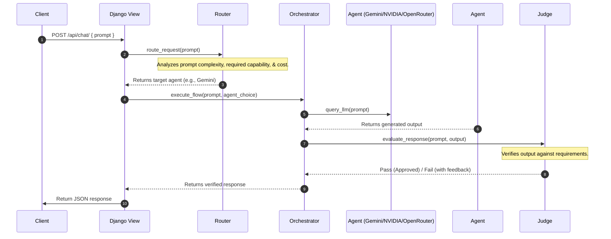

# Think0by1: AI Agent Routing and Orchestration Platform

Welcome to the **Think0by1** developer and AI agent instructions. This file acts as the project specification, directory guide, and development guidelines for this workspace.

---

## 1. Project Overview
**Think0by1** is an intelligent AI orchestration platform designed to route, coordinate, and evaluate LLM-based agents. The system utilizes a multi-agent backend architecture in Django to process user queries efficiently by:
1. **Routing** requests to the most appropriate agent or LLM based on task complexity, cost, latency, and capability.
2. **Orchestrating** multi-step tasks across multiple backend agents (e.g., dividing a task into subtasks, passing context between agents).
3. **Evaluating/Judging** the responses to ensure they meet quality, formatting, and correctness standards before sending them to the user.

---

## 2. Directory Structure & File Map

```
Think0by1/
│
├── .gitignore                      # Git ignore rules for Django, Python, OS, & IDEs
├── AI_INSTRUCTIONS.MD              # This project guide and instruction sheet
│
├── Backend/                        # Django backend folder
│   ├── manage.py                   # Django CLI tool
│   ├── db.sqlite3                  # Local SQLite database (ignored by Git)
│   │
│   ├── think0by_django_folder/     # Django configuration folder
│   │   ├── settings.py             # Project settings (databases, apps, middleware)
│   │   ├── urls.py                 # Core routing definitions
│   │   └── wsgi.py / asgi.py       # WSGI/ASGI entrypoints
│   │
│   └── apis/                       # Principal Django App for API services
│       ├── views.py                # Handles HTTP requests & outputs JSON
│       ├── urls.py                 # App-specific URL endpoints (e.g., /api/chat)
│       │
│       ├── agents/                 # LLM Client Integrations
│       │   ├── gemini_agent.py     # Connects to Google Gemini API
│       │   ├── nvidia_agent.py     # Connects to NVIDIA API / NIMs
│       │   └── openrouter_agent.py # Connects to OpenRouter API (Anthropic, OpenAI, etc.)
│       │
│       └── services/               # Core Orchestration Logic
│           ├── router.py           # Evaluates inputs and determines which Agent to call
│           ├── orchestrator.py     # Coordinates multi-agent flows and keeps state
│           └── judge.py            # Evaluates agent outputs for validation
│
└── Frontend/                       # Frontend application directory (React / Next.js / Vite)
```

---

## 3. High-Level Architecture & Workflow

When a client makes a request to `Think0by1` backend:



---

## 4. Implementation Guidelines for Each File

### 4.1. Agents (`Backend/apis/agents/`)
Each file in this directory represents a dedicated class wrapping the API client for a specific LLM provider.
- **`gemini_agent.py`**:
  - Should implement a class `GeminiAgent`.
  - Use `google-genai` SDK or standard HTTP client.
  - Load api key from environment variables (`GEMINI_API_KEY`).
  - Implement a standard interface method, e.g., `def query(self, prompt: str, system_instruction: str = None) -> str`.
- **`nvidia_agent.py`**:
  - Should implement `NvidiaAgent`.
  - Interfaces with NVIDIA API Catalog / NIMs using OpenAI compatibility interface.
  - Load api key from `NVIDIA_API_KEY`.
- **`openrouter_agent.py`**:
  - Should implement `OpenRouterAgent`.
  - Interfaces with OpenRouter to query models like Claude 3.5 Sonnet, GPT-4o, etc.
  - Load api key from `OPENROUTER_API_KEY`.

### 4.2. Services (`Backend/apis/services/`)
- **`router.py`**:
  - Contains class `LLMRouter`.
  - Analyzes the input prompt. Can use a lightweight model call (e.g., Gemini Flash) or rule-based heuristics to classify if the prompt is simple, complex, coding-related, creative, etc.
  - Recommends the appropriate model (e.g., `gemini-2.5-flash` for simple tasks, `claude-3.5-sonnet` for heavy coding tasks via OpenRouter).
- **`orchestrator.py`**:
  - Contains class `AgentOrchestrator`.
  - Handles multi-step orchestration. If a query requires searching the web, coding, and formatting, it breaks the task down, calls appropriate agents sequentially, and maintains the intermediate state.
- **`judge.py`**:
  - Contains class `ResponseJudge`.
  - Validates outputs. For code output, it checks if code snippets exist. For JSON outputs, it parses and validates schema. It can use LLM-as-a-judge to evaluate if the response is helpful and follows formatting constraints.

---

## 5. Development Rules & Guidelines

1. **Environment Variables**:
   - Do **NOT** hardcode API keys or secret keys in any Python file.
   - Use a `.env` file at the root of the project to define:
     ```env
     SECRET_KEY=your-django-secret-key
     GEMINI_API_KEY=your-gemini-key
     NVIDIA_API_KEY=your-nvidia-key
     OPENROUTER_API_KEY=your-openrouter-key
     ```
   - Use Python libraries like `python-dotenv` or `django-environ` to load them.

2. **Clean separation of Concerns**:
   - Views in Django should only receive parameters, invoke the `AgentOrchestrator` or `LLMRouter`, handle HTTP exceptions, and return clean JSON.
   - All core business and LLM interaction logic should reside inside the `services/` and `agents/` directories.

3. **Consistent Error Handling**:
   - Implement try-except blocks around LLM API calls to catch connection timeouts, rate limit errors, and invalid API keys gracefully.
   - Return clean, user-friendly error messages (e.g. `{"error": "Agent failed to respond"}`) instead of letting the raw SDK stack trace bubble up to the client.