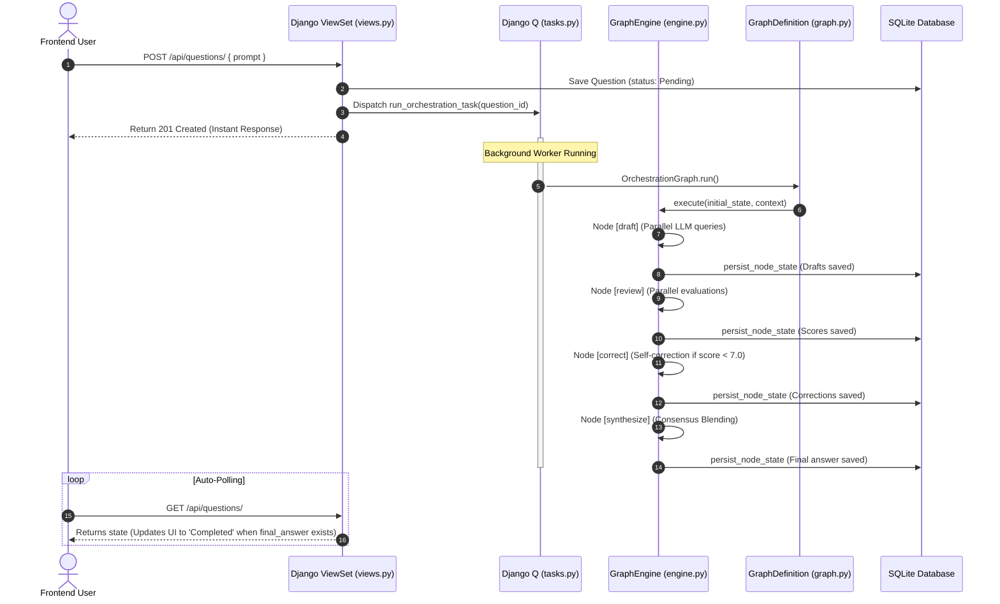

# Think0by1: Multi-Agent Collaborative StateGraph Engine

Think0by1 is an asynchronous, high-performance **Multi-Agent Orchestration Platform** built with **Django**, **Django REST Framework (DRF)**, and **Django Q2**. 

Instead of relying on a single AI model's output or a rigid linear script, it implements an extensible **StateGraph Orchestration Engine**. Multiple LLM models (Gemini, NVIDIA Llama, and OpenRouter models) collaborate, evaluate, critique, and correct each other's drafts through structured peer-review cycles in the background, blending their collective strengths into a highly refined final answer.

---

## 🚀 Key Features

*   **StateGraph Orchestration Engine:** Decouples execution logic into pure, environment-agnostic nodes and edges. Features copy-on-write immutable states (`OrchestrationState`) to cleanly manage history and prevent side-effects.
*   **Asynchronous Background Processing (Django Q2):** HTTP requests return immediately with zero blocking. Heavy multi-agent LLM reasoning is offloaded to a background task cluster using the local Django ORM broker (no Redis configuration required).
*   **Round-Robin Peer Review:**
    *   **Gemini** (Optimistic Innovator) reviews and critiques **NVIDIA Llama's** draft.
    *   **NVIDIA Llama** (Strict Security Auditor) reviews and critiques **OpenRouter's** draft.
    *   **OpenRouter** (Performance Optimizer) reviews and critiques **Gemini's** draft.
*   **Structured Outputs (Pydantic):** Deprecates brittle regex string parsing. Leverages `Pydantic` schemas for peer evaluation results (`score` and `critique`) with a robust lenient fallback mechanism.
*   **Real-time UX Auto-Polling:** The lightweight Vanilla JavaScript frontend automatically detects pending questions, displays a flashing **"Thinking..."** state, polls progress in the background, and stops polling once all answers are synthesized.

---

## 📐 System Architecture & Flow



---

## 📂 Project Structure

```
Think0by1/
├── .gitignore                      # Git ignore rules for Django, Python, OS, & IDEs
├── README.md                       # This project guide
├── DEVELOPER_GUIDE.md              # Detailed walkthrough of coding concepts
│
├── Backend/                        # Django backend root
│   ├── manage.py                   # Django management CLI
│   ├── db.sqlite3                  # Local SQLite database
│   │
│   ├── think0by_django_folder/     # Django configuration folder
│   │   ├── settings.py             # App registrations, CORS, & Django Q cluster settings
│   │   └── urls.py                 # Project-level URL patterns
│   │
│   └── apis/                       # Principal Django App for API services
│       ├── models.py               # Question and ModelResponse DB schemas
│       ├── serializer.py           # Nested serializations for API communication
│       ├── views.py                # ModelViewSets with non-blocking background dispatch
│       ├── tasks.py                # Django Q background worker tasks
│       ├── schemas.py              # Pydantic validation schemas
│       ├── prompts.py              # Centralized PromptManager and Persona registry
│       ├── urls.py                 # App-specific URL mapping
│       │
│       ├── agents/                 # Standardized LLM wrappers
│       │   ├── base_agent.py       # Abstract Base Class supporting async query threads
│       │   ├── gemini_agent.py     # Gemini client SDK connection
│       │   ├── nvidia_agent.py     # NVIDIA NIM standard OpenAI client
│       │   └── openrouter_agent.py # OpenRouter auto-free agent client
│       │
│       ├── services/               # Legacy Services
│       │   ├── judge.py            # Peer reviewer scoring validation
│       │   └── orchestrator.py     # Legacy sequential orchestrator
│       │
│       └── engine/                 # StateGraph Orchestration Engine
│           ├── state.py            # Immutable OrchestrationState definitions
│           ├── context.py          # Decoupled ExecutionContext
│           ├── graph_def.py        # Declarative GraphDefinition builder
│           ├── engine.py           # execution logic runner
│           ├── nodes.py            # Pure async node functions (draft, review, etc.)
│           └── graph.py            # Concrete Think0by1 Graph & DB persistence hooks
│
└── Frontend/                       # Frontend application
    └── index.html                  # Dashboard UI with auto-polling & flashing status
```

---

## ⚙️ Setup and Installation

### 1. Clone the repository and navigate to Backend
```bash
cd Think0by1/Backend
```

### 2. Create and Activate Virtual Environment
```bash
python -m venv .venv
# On Windows PowerShell:
.\.venv\Scripts\Activate.ps1
```

### 3. Install Dependencies
```bash
pip install django djangorestframework django-cors-headers google-genai openai python-dotenv requests django-q2 pydantic
```

### 4. Configure Environment Variables
Create a `.env` file in the root `Think0by1/` folder (or `Backend/` folder):
```env
SECRET_KEY=your-django-secret-key
GEMINI_API_KEY=AIzaSy...your_gemini_key
NVIDIA_API_KEY=your_nvidia_nim_key
OPENROUTER_API_KEY=your_openrouter_key
```

### 5. Apply Migrations
Initialize database tables for Django Q and APIs:
```bash
python manage.py makemigrations apis
python manage.py migrate
```

### 6. Start the Background Task Cluster (New Terminal Window)
```bash
python manage.py qcluster
```

### 7. Start Django Server
```bash
python manage.py runserver
```

### 8. Run the Frontend
Simply double-click `Frontend/index.html` to open it in your browser. Submit a prompt and watch the multi-agent network think and collaborate in real-time!
