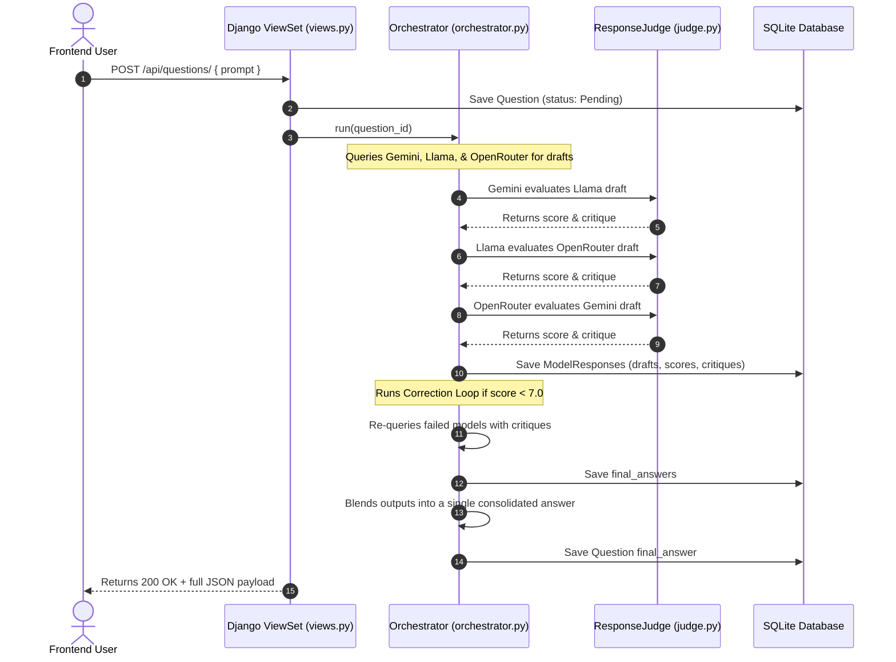

# Think0by1: Multi-Agent Collaborative Peer-Review Network

Think0by1 is a high-performance **Multi-Agent Orchestration Platform** built with **Django** and **Django REST Framework (DRF)**. Instead of relying on a single AI model's output, it implements a **democratic round-robin peer-review consensus system** where multiple LLM models (like ie Gemini, NVIDIA Llama, and OpenRouter models) collaborate, evaluate, critique, and correct each other's drafts to produce a highly refined final answer.

This project is a showcase of clean OOP design, Django ORM database state management, REST API architecture, and advanced AI agent workflows.

---

## 🚀 Key Features

*   **Round-Robin Peer Review (Consensus Mechanism):** 
    *   **Gemini** reviews and critiques **NVIDIA Llama's** response.
    *   **NVIDIA Llama** reviews and critiques **OpenRouter's** response.
    *   **OpenRouter** reviews and critiques **Gemini's** response.
*   **Criticism & Self-Correction Loop:** If any model's peer-review score is below the threshold (`7.0 / 10.0`), the system triggers a correction loop, sending the specific peer critique back to the original model for self-correction.
*   **Consensus Blending:** Once all drafts are finalized, the system queries a master model (Gemini) to edit and consolidate all three models' strengths into a single, cohesive `final_answer`.
*   **Fault-Tolerant Fallback System:** Built with first-principles robustness. If an external model's API key is missing or fails due to network issues, the orchestrator catches the exception gracefully, notes the failure in the database, and falls back to active models (like Gemini) to complete the review cycle without crashing the web server.
*   **Django REST API Backend:** Exposes fully serialized CRUD endpoints for questions and responses using DRF ViewSets and Routers.
*   **Interactive Frontend:** A clean, lightweight Vanilla JavaScript dashboard that communicates with the API via the browser's native `fetch()` API.

---

## 📐 System Architecture & Flow



---

## 🛠️ Tech Stack

*   **Backend:** Python 3.12+, Django, Django REST Framework (DRF), django-cors-headers
*   **AI Integrations:** Google GenAI SDK (`google-genai`), OpenAI Python Client (for NVIDIA NIMs and OpenRouter compatibility)
*   **Database:** SQLite (Django ORM managed)
*   **Frontend:** HTML5, CSS3, Vanilla JavaScript (Fetch API, DOM Manipulation)

---

## 📂 Project Structure

```
Think0by1/
├── .gitignore                      # Git ignore rules for Django, Python, OS, & IDEs
├── README.md                       # This project portfolio guide
├── DEVELOPER_GUIDE.md              # Detailed walkthrough of coding concepts
│
├── Backend/                        # Django backend root
│   ├── manage.py                   # Django management CLI
│   ├── db.sqlite3                  # Local SQLite database
│   │
│   ├── think0by_django_folder/     # Django configuration folder
│   │   ├── settings.py             # App registration, middleware, and CORS config
│   │   └── urls.py                 # Project-level URL patterns
│   │
│   └── apis/                       # Principal Django App for API services
│       ├── models.py               # Question and ModelResponse DB schemas
│       ├── serializer.py           # Nested serializations for API communication
│       ├── views.py                # ModelViewSets and lifecycle overrides
│       ├── urls.py                 # App-specific URL mapping
│       │
│       ├── agents/                 # Standardized LLM wrappers
│       │   ├── base_agent.py       # Abstract Base Class for polymorphism
│       │   ├── gemini_agent.py     # Gemini client SDK connection
│       │   ├── nvidia_agent.py     # NVIDIA NIM standard OpenAI client
│       │   └── openrouter_agent.py # OpenRouter standard OpenAI client
│       │
│       └── services/               # Core Orchestration Logic
│           ├── judge.py            # Peer reviewer prompt instructions and JSON parsers
│           └── orchestrator.py     # Round-robin reviewer logic and consensus generator
│
└── Frontend/                       # Frontend application
    └── index.html                  # Dashboard UI (Fetch API client)
```

---

## ⚙️ Setup and Installation

### 1. Clone the repository and navigate to Backend
```bash
cd Think0by1/Backend
```

### 2. Create and Activate Virtual Environment
```bash
python -m venv .venv
# On Windows PowerShell:
.\.venv\Scripts\Activate.ps1
```

### 3. Install Dependencies
```bash
pip install django djangorestframework django-cors-headers google-genai openai python-dotenv requests
```

### 4. Configure Environment Variables
Create a `.env` file in the root `Think0by1/` folder (or `Backend/` folder):
```env
SECRET_KEY=your-django-secret-key
GEMINI_API_KEY=AIzaSy...your_gemini_key
NVIDIA_API_KEY=your_nvidia_nim_key
OPENROUTER_API_KEY=your_openrouter_key
```

### 5. Apply Migrations & Start Server
```bash
python manage.py makemigrations apis
python manage.py migrate
python manage.py runserver
```

### 6. Run the Frontend
Simply double-click `Frontend/index.html` to open it in your browser, or serve it using any local static web server. Submit a prompt and watch the multi-agent network collaborate!

---

## 📈 Key Concepts & Engineering Challenges

1.  **Polymorphism in LLM APIs:** By designing an abstract `BaseAgent` class, all model integrations (Google GenAI SDK vs. OpenAI HTTP standard client) are represented identically, making the orchestrator completely decoupled from client implementation details.
2.  **State Consistency & Cascades:** Implemented a robust 1-to-many relationship where model responses are bound to their parent question using Django's ORM, leveraging `related_name='responses'` to support nested JSON serialization natively.
3.  **Structured JSON Outputs:** Configured system instructions and model schemas to enforce JSON responses from LLM evaluations, writing custom regex cleaning utilities to bypass markdown code blocks returned by various providers.
4.  **CORS & Browser Security:** Configured Cross-Origin Resource Sharing (CORS) middle-layers in Django to safely expose the REST endpoints to a decoupled HTML file.
